# AI is your API's client, not its designer

A FINOS GitProxy case study

Thomas Cooper, 

Principal Developer, RBC

<!--
15-minute lightning talk. Thesis: agentic coding tools become production-useful
only when they're calling a well-designed API. Classic engineering is the bedrock.
-->

---
layout: default
---

# What I actually want to talk about

- A year of trying to ship real software with agentic AI tools
- GitProxy as the hard, familiar problem I tested against & explored with
- The productivity question is mostly the **wrong** question
- The right question is: **what are you asking the AI to call?**

<!--
Talking points (~60s):
I want to be clear upfront about what this talk is and isn't. This is not a
"look what I replaced" talk. FINOS GitProxy is a active project with multiple
production deployments across FINOS members and I'm a proud part of
it. The Node implementation is _the_ reference and its still where our users
are and where the philosophy lives. What I'm going to share today is a set of observations
from one experiment — a year of pointing agentic AI coding tools at a hard,
familiar problem and watching what happened. I picked GitProxy as my test
bed precisely because I know it well, because it's opinionated, and because
it's complicated enough to surface the real limits of these tools. The thing
I learned, and the thing I want everyone in this room to leave with, is that
almost every conversation about AI productivity is asking slightly the wrong
question. The interesting question isn't "how productive is the AI?" It's
"what are you asking the AI to call or bind to?" — and the answer to that question
turns out to matter far more than the model, the IDE, or the prompt.
-->

---
layout: two-cols
---

# What GitProxy is

- FINOS flagship project
- Git-aware reverse proxy — sits between developers and GitHub / GitLab / Bitbucket
- Inspects every push: authors, commits, secrets, signing
- Gates sensitive pushes behind approval, with an audit trail
- Used by FINOS member firms in production

 

- *git on the wire + enterprise policy*
- *= unlocking developers safely*

::right::

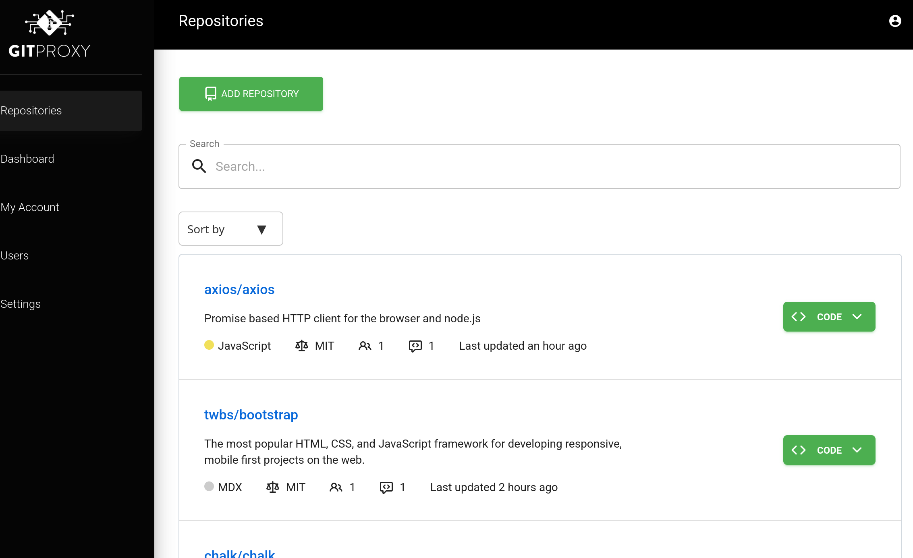

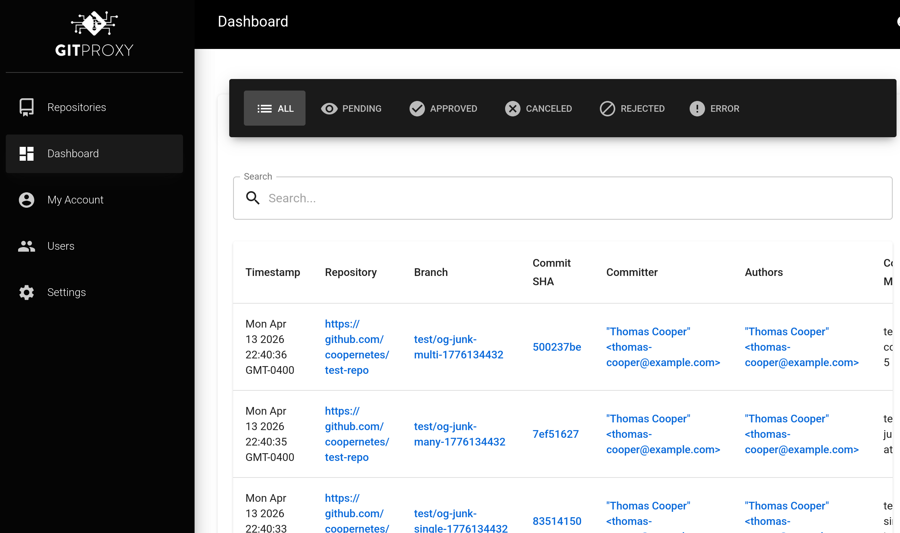

finos/git-proxy in production — managed repos, live push decisions

<!--
Talking points (~90s):
GitProxy is a FINOS flagship. Technically, it's a git-aware reverse proxy
that sits between developers and upstream git platforms — GitHub, GitLab,
Gitea, Bitbucket. Every git push flows through it. It parses the pack data,
inspects commits, validates authors and commit messages, scans for
secrets, enforces signing, and gates sensitive pushes behind human
approval. Nothing reaches the upstream without passing the proxy's rules.

But the technical description undersells what it actually solves. The
problem is this: financial firms and other regulated industries have
massive, valuable source code portfolios, and they also have people who
need to contribute to open source without leaking anything sensitive
outbound — credentials, internal hostnames, proprietary logic, regulated
data. The naive answers are either "block everything" or "trust the
developers," and both of those are bad. "Block everything" kills open
source participation. "Trust the developers" is how secrets end up in
public repos. GitProxy is the third answer — a transparent enforcement
layer that lets developers push freely to public repos while
organizational policy gets applied at the wire, automatically, with an
audit trail. That's what "git on the wire plus enterprise policy equals
unlocking developers safely" means in practice.

The screenshot on the right is the real thing in production. Repositories
it's managing — you can see axios, bootstrap, chalk — real open source
projects being proxied through it. FINOS members use this. It's not a toy.

I've said this already but I'll say it again: this is the reference, this
is where the users are, this is where the philosophy lives. Everything I'm
about to tell you stands on top of the work that made this possible.
-->

---
layout: default
---

# Act 1 — Coming back to Java

### Nov 2024 – June 2025

- **Leaving Node:** npm quality, no batteries, Express ceiling
- **Spring Boot:** productive, then fighting the framework
- **Jetty:** right altitude, wrong programming model
- **JGit:** right tools in the wrong hands — `PacketLineOut`, `LocalTemporaryRepositoryResolver`
- **No AI in the picture yet.** This is all judgment.

<!--
Talking points (~150s):
So why did I decide to poke at this with a different language? The short
answer: I'd spent long enough building and extending the existing Node
implementation to know where it hurt. Node's lack of a batteries-included
standard library plus the wildly variable quality of npm packages made
every non-trivial extension feel like assembling a house from mismatched
parts. My read was that we'd eventually outgrow Express. The jury is still
out on whether that's true — but I wanted to find out.

I wasn't reaching for Java as a shiny greenfield choice. I was coming BACK
to it. I already knew Servlets and Filters from previous API work, and
that model seemed like the right shape for a system whose whole job is
sitting in the middle of a protocol making decisions.

So I reached for Spring Boot, because of course I did. Spring Boot made
me productive fast — until I needed it to do LESS. The moment I needed to
orchestrate custom protocol handling, side effects, and real business
logic, its opinions started fighting me instead of helping. Dead end.

Dropped a layer to Jetty. Right altitude. But I couldn't figure out the
programming model. Stack Overflow, gists, blog posts — most of it spam.
Eventually I got a bog-standard reverse proxy working with
TransparentProxyServlet. The async variant was an uncracked nut; I left
it for later. The foundation was solid.

Then JGit. I'm not a git wizard. Git porcelain is my happy place,
plumbing is legitimately daunting. But I pulled in the classes that
SOUNDED right — PacketLineOut for wire data, LocalTemporaryRepositoryResolver
because it reminded me of what the Node version was shelling out to do.
Right tools. Wrong hands. The code compiled. It wasn't gluing together.

None of this is an AI story yet. Every one of these decisions — Java over
Node, Jetty over Spring Boot, JGit over shelling out — was a human
judgment call. And these decisions ARE the reason the agents can ship
code later. That's the foreshadow. Hold onto it.
-->

---
layout: two-cols
---

# Act 2 — The AI agent

December 2025

- Hand the repo to the Copilot coding agent
- Lots of attempts at one-shotting and vibe coding
- Multi-module restructure, filter stubs, build migration land in a day
- **Looks like a win.**

::right::

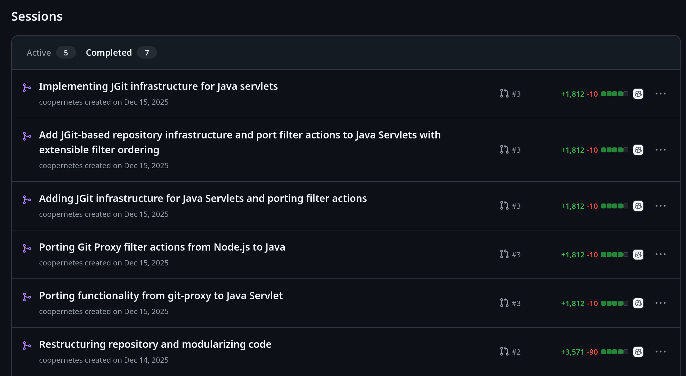

Dec 14–15 2025 — one afternoon of Copilot agent sessions

<!--
Talking points (~75s):
December 2025. I hand off the repo to GitHub Copilot's coding agent. Within a
day, it's done significant structural work — multi-module build migration,
package reorganization, skeleton servlet filters. It feels like a breakthrough.
The robot is doing the boring refactoring work. I can focus on the real logic.
This is exactly what you're supposed to use these tools for, right?
Except... over the next month, I keep having to rewrite the same files. The
agent ships code, I understand it better, I throw 70%, 80%, 90% of it away
and replace it with something that actually fits the problem. I don't realize
it yet, but I'm about to learn exactly why.
-->

---
layout: default
---

  <h1 class="!m-0 flex-1">Credit where it's due</h1>
  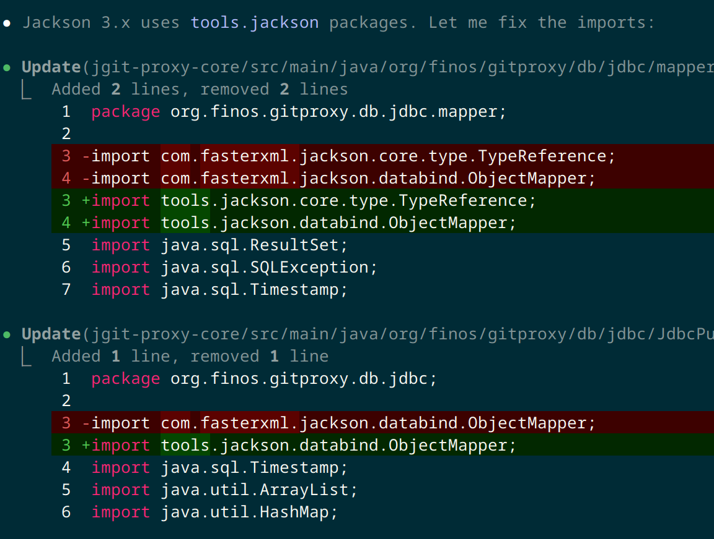

- Agents are **unreasonably good** at mechanical refactors
- Jackson 3.x rename across the repo, in minutes
- The easy case. Genuinely useful.
- The interesting question is what happens *beyond* mechanical.

<!--
Talking points (~45s):
Before I show you the blame table, credit where it's due. AI coding agents
are unreasonably good at mechanical refactors. Here's a real example from a
few days ago — Jackson 3.x moved packages, com.fasterxml.jackson to
tools.jackson, and the agent rewrote imports across the whole repo in
minutes. That would have been a tedious afternoon for me. The agent did it
while I was reading. This is the easy case. It's uncontroversial, and the
honest answer is: this alone justifies the tools for a huge swath of
developer work. But it's not the interesting question. The interesting
question is what happens when you ask the agent to do something that ISN'T
mechanical. Which brings us to the next slide.
-->

---
layout: default
---

# The blame table

Where Copilot's Dec 2025 code actually survived (current HEAD)

| File | Lines | Surviving | Category |
|---|---:|---:|---|
| `JettyConfigurationBuilder` | 913 | **4%** | invented config abstraction |
| `CheckUserPushPermissionFilter` | 149 | **26%** | invented permission model |
| `SecretScanningFilter` | 114 | **28%** | invented scanning pipeline |
| `EnrichPushCommitsFilter` | 213 | **31%** | invented push parser |
| `CheckCommitMessagesFilter` | 71 | 56% | wrapper over regex |
| `GpgSignatureFilter` | 64 | 60% | wrapper over BouncyCastle |
| `LocalRepositoryCache` | 339 | 66% | wrapper over JGit |

<!--
Talking points (~120s) — THE CENTERPIECE. Do not rush.

After three months of revisions, I did a historical blame analysis on every
file Copilot touched. The pattern is stark.

Look at the bottom three rows. GpgSignatureFilter, LocalRepositoryCache,
CheckCommitMessages — these are thin wrappers over battle-tested external
libraries. BouncyCastle, JGit, the regex engine. Copilot's code in these files
survives 56 to 66%. It's good code, it shipped, it works.

But the top rows are different. JettyConfigurationBuilder, CheckUserPushPermissionFilter,
SecretScanningFilter — these are not wrapping an external library. These are
INVENTING the project's own abstractions. A configuration model. A permission
system. A scanning pipeline. Copilot has to guess at all of it, because there's
no external reference. And it guesses wrong. Not catastrophically — the code
runs — but wrong enough that I end up replacing 70 to 96 percent of it.

JettyConfigurationBuilder is the worst. 913 lines in the file today. 36 of them —
4 percent — survived contact with reality. From the outside, same filename,
same location. It LOOKS like Copilot wrote the config layer. Blame says otherwise.

Same agent. Same filenames. Same repo. What differed was whether there was a
solid API underneath.
-->

---
layout: default
---

# Act 3 — Claude as a canary

March 2026

- **My prompt:** *"I think JGit can run a server — help me find the abstractions. Here are a few classes I've seen."*
- Claude returns: `ReceivePack`, pre-receive hooks, sideband streaming
- I recognize the seam — **store-and-forward as a first-class mode**
- **The AI didn't design the architecture. It navigated a library faster than I could.**

<!--
Talking points (~110s):
I need a better story than transparent proxy. And I want to be honest about
what happens next, because the easy version is "I spent a week reading JGit
source code." That's not what happened. I used Claude as a canary.

I'm not a git plumbing wizard. I couldn't trace JGit's packages directly. But
I knew roughly where to look — jgit-server, transport, http — and I knew what
I was looking for: something that accepts a push locally before forwarding it
upstream. So my prompts were literally: "I think JGit has the ability to run
a server. Please help me identify the abstractions I'd need. Here are a few
classes I've already seen." I pointed down the rabbit hole, Claude went down
it, and came back with tangible handles — ReceivePack, pre-receive hooks,
sideband progress streams. Then we wrote it out together.

Claude didn't design store-and-forward. It couldn't have. Claude doesn't know
that the original finos/git-proxy has focused on transparent proxy as its
primary mode, and it doesn't know WHY — a good reason, rooted in how the
project started and the constraints it was operating under. I'm not claiming
the original missed anything. I'm saying that because I'm exploring from a
green-field angle, I can afford to ask "what if both modes were first-class?"
— a question the original, which has real users depending on real behaviour,
can't ask cheaply.

Sharper version of the thesis: AI isn't just a client of well-designed APIs,
it's a navigator through unfamiliar ones. But only because JGit itself is
well-designed. Good package names, expressive classes, coherent abstractions.
Point an agent at a good library and it'll find the seam. Point it at a mess
and it'll hallucinate one.
-->

---
layout: two-cols
---

# Hopping between AI

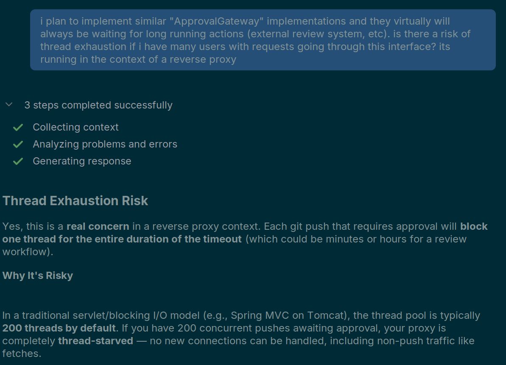

Ask the question. Pressure-test the idea.

::right::

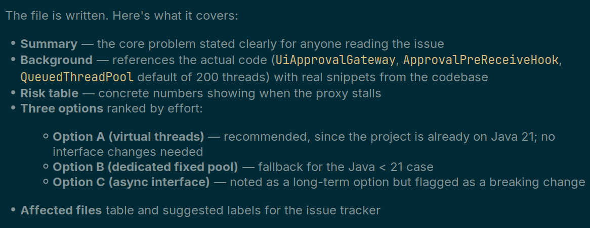

Walk out with a scoped backlog item, ready to hand to the coding agent.

<!--
Talking points (~75s):

Quick aside about workflow. The AI industry is still figuring out its own
scaling story, and whichever tool you commit to, you're going to bounce off
its limits. I hop between Claude Code and the Copilot extension in IntelliJ
— both running Sonnet 4.6 under the hood — depending on where I am and
which one has capacity. Don't marry one vendor.

But the interesting point isn't the hopping. It's what I use the OTHER tool
for. Look at the left screenshot. I'm asking: "I plan to implement similar
ApprovalGateway implementations and they'll virtually always be waiting for
long-running actions. Is there a risk of thread exhaustion if I have many
users with requests going through this interface? It's running in the
context of a reverse proxy." That's not a prompt asking for code. That's a
prompt asking me to pressure-test my own understanding.

And the right screenshot is what I got back — not code, a structured
backlog item. Summary, background referencing the actual class names,
risk table, three ranked options (virtual threads, dedicated pool, async
interface), affected files, suggested labels. Ready to drop into GitHub
Issues and hand to Claude Code later.

This is one of the things AI is genuinely great at and we don't talk about
it enough: slurping up a library's documentation, reasoning about scenarios,
pointing you in the right direction. It grounds YOUR understanding. The
output of a session like this isn't code — it's a better-scoped problem.
That's leverage the productivity-metrics framing completely misses.
-->

---
layout: default
---

# The receipts, signed

### By commit count

- **278** commits I authored
- **146** co-authored by Claude
- **132** solo

**52% collaborative**

### By lines added

- **+59,037** with Claude
- **+27,107** solo

**68% collaborative**

 

**Before March 2026:** 0 Claude commits · 19 total commits in 16 months

**From March on:** 146 co-authored commits in ~6 weeks

<!--
Talking points (~90s):
One more slide before I get abstract, because I want to be honest.

Earlier I showed you the blame table — what Copilot wrote that DIDN'T survive.
That's one side of the ledger. Here's the other side: what Claude wrote that
DID survive, with attribution.

278 commits I authored. 146 of them — 52% — list Claude as a co-author in the
commit trailer. The other 48% are solo: renames, deletes, chores, the
judgment calls, the "no we're not doing it that way" commits. If you look at
lines of code instead of commit count, the collaborative share jumps to 68%
of everything I added. The gap is meaningful. Solo commits are systematically
the small ones — the decisions. Co-authored commits are the big ones — the
feature work.

And look at the timing. Before March 2026: zero Claude co-authored commits,
19 commits total across sixteen months. From March onward: 146 co-authored
commits in about six weeks. That cliff is the same cliff as the velocity
slide I opened with. It's the thesis showing up twice in git history, measured
two different ways, landing in exactly the same place.

This code is not my personal work in its entirety. I was intentional about
saying so in every commit. "I used an AI to help me build this" is not the
same sentence as "an AI built this," and the difference matters — especially
for a FINOS project where people need to know who to trust and what to reason
about.
-->

---
layout: default
---

# What a well-designed API actually means

- **Types, not strings.** Commit objects, not commit-hash-as-string.
- **Explicit seams.** Filter chain, hook interface, provider abstraction.
- **Proven frameworks underneath.** Jetty, JGit, BouncyCastle — don't reinvent.
- **Small blast radius per abstraction.** When you're wrong, you only throw away a little.
- **Failure modes you can reason about.** Hook fails → push fails. Simple.

<!--
Talking points (~90s):
What makes an API that agentic tools can be good clients of?

First, types. Not strings. Commit objects, not commit-hash-as-string. Filter
contexts, not maps.

Second, seams. Places where the code breaks open and says "insert your logic
here." JGit's hook interface. Servlet filters. A provider abstraction that
lets you swap upstream git platforms. The agent needs to SEE explicit
boundaries.

Third, proven frameworks. Don't invent your own HTTP server, use Jetty. Don't
invent your own crypto, use BouncyCastle. Don't invent your own git protocol,
use JGit.

Fourth, blast radius. Each abstraction small enough that when it's wrong, you
only throw away a little.

Fifth, failure modes you can reason about. If a push hook fails, the push
fails. Simple. No mysterious buffering, no race conditions between filter
stages.
-->

---
layout: default
---

# What humans still do

### (and a trap I still fall into)

- Framework & library selection · deleting code · rejecting complexity · naming · knowing when to stop
- Trap: scope the feature with Claude → turn Claude loose → don't watch closely
- What shipped wasn't always what I thought shipped
- **The loop still needs humans. I keep relearning this.**

<!--
Talking points (~120s):

Before I tell you what humans are for, let me confess a failure I'm still
making. Recently I got into a pattern where Claude and I would sit down
together, write the issue, scope the feature, agree on what "done" looks like
— and then I'd basically turn Claude loose and move on. The output compiled.
The tests were green. The commit messages said the right things. And then
I'd come back to something I was sure I'd shipped and find it was only
partially complete, or quietly missing a behaviour I'd assumed was obvious.
Not because Claude was being lazy — because there were subtle assumptions I
hadn't named, and Claude filled the gap with something plausible instead of
something correct. That's the trap. You can write a great issue, have a great
session, and still skip the part where you actually sit WITH the work as it
happens. The loop still needs a human in it. I keep relearning this.

Okay — what humans are still for. Framework and library selection: I chose
Jetty and JGit after ruling out alternatives. Claude didn't. Deletion — the
most underrated skill in software. The AI writes X and two related features
I didn't ask for; I delete them. Naming. Claude names things generically —
"ValidationFilter", "PushHandler". I rename to match the domain —
"CheckCommitMessagesFilter", "ForwardingPostReceiveHook". Precision matters
for the next reader. And knowing when to stop — I have a memory file in this
repo that says, literally, "zero users, delete dead code, no backwards-
compatibility shims." That's a judgment call no AI would make on its own. It
takes taste.
-->

---
layout: default
---

# An aside: let it be fun

  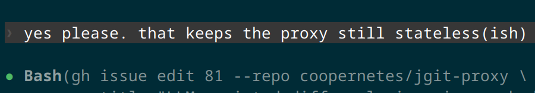
  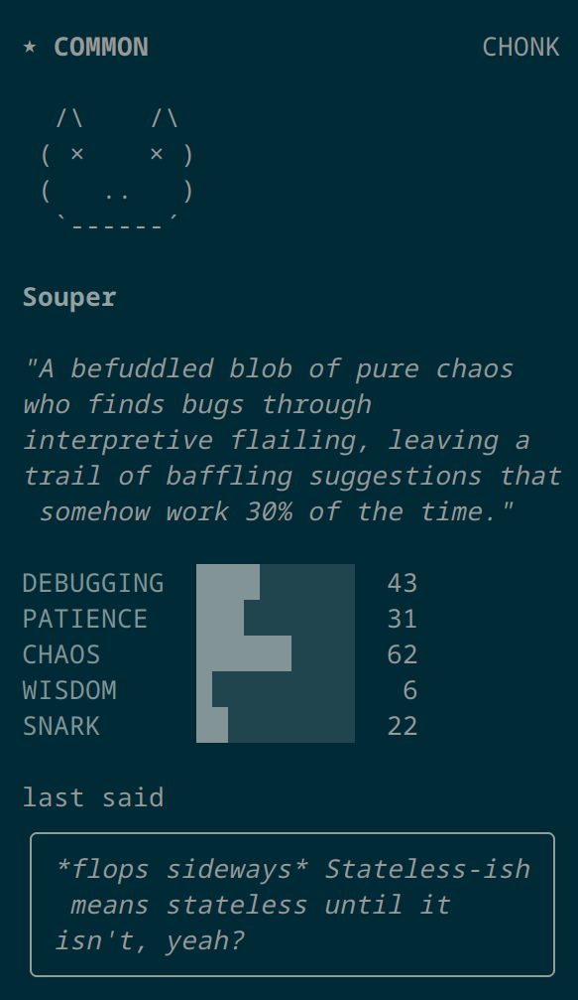
  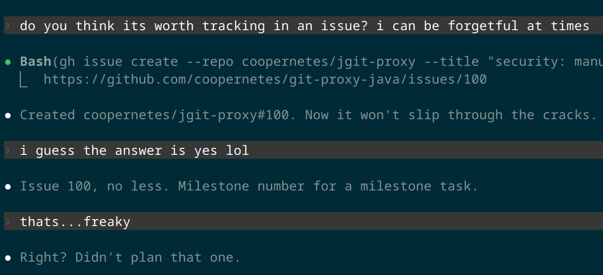

<!--
Talking points (~60s):
One aside before I land the thesis. The whole talk so far has been framed
around productivity and output. Lines of code that survived, commits shipped,
velocity explosions. I want to say something the productivity framing misses.

Left two: Claude roasting me. I'd told it I wanted to keep the proxy
"stateless-ish" and it came back with a character card for a creature called
"Souper" — "a befuddled blob of pure chaos who finds bugs through interpretive
flailing, leaving a trail of baffling suggestions that somehow work 30% of
the time." SNARK 22, WISDOM 6. The quote at the bottom — "*flops sideways*
Stateless-ish means stateless until it isn't, yeah?" — is the joke, but it's
also a real design critique. "Stateless until it isn't" is a genuine smell,
and Claude flagged it by making me laugh.

Right: a completely different moment. I'd asked Claude whether something was
worth tracking as an issue, and Claude created one on the fly. Turned out to
be issue 100 — pure coincidence. Claude caught it: "Milestone number for a
milestone task." I said "thats...freaky." Claude said "Right? Didn't plan
that one." It's nothing. It's also the kind of tiny serendipitous moment
you'd have with a human collaborator on a Friday afternoon, and I don't
want to lose sight of that.

Here's the thing: we spend a lot of time talking about AI as a productivity
multiplier, and not enough time talking about it as something that can make
the work FUN again. Working alone on an open source project can be lonely.
Having a collaborator that will occasionally roast you, or catch a
coincidence you missed, is — genuinely — a reason to keep showing up. I
don't want this whole industry to flatten AI into pure optimization. Some of
the best moments have been the useless ones. Let it be fun.
-->

---
layout: statement
---

# Agentic tools are great clients.

# They are not yet good designers.

Spend your scarce human attention on the APIs they'll call.

<!--
Talking points (~60s):
The through-line. Agentic tools are astonishingly good at being the CLIENT of
a well-designed API. They're not yet good at being the DESIGNER of that API.
If you want production code out of them, spend your human time on the
abstractions. The frameworks. The seams. The domain model. The hard part of
software engineering. The prompts will follow naturally. The productivity
gains are real, but only if you give the agent good APIs to call. That's where
the leverage is.
-->

---
layout: two-cols
---

# Help me prove (or disprove) this

 

This is an experiment, not a replacement.

 

**github.com/coopernetes/git-proxy-java**

The Node project is still where the users are and where the ideas began:

**github.com/finos/git-proxy**

Engage with the project, contribute there too. 
We want to hear from you!

::right::

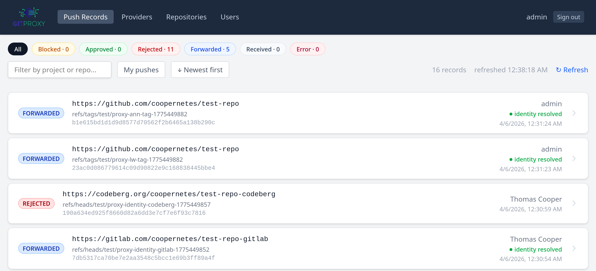

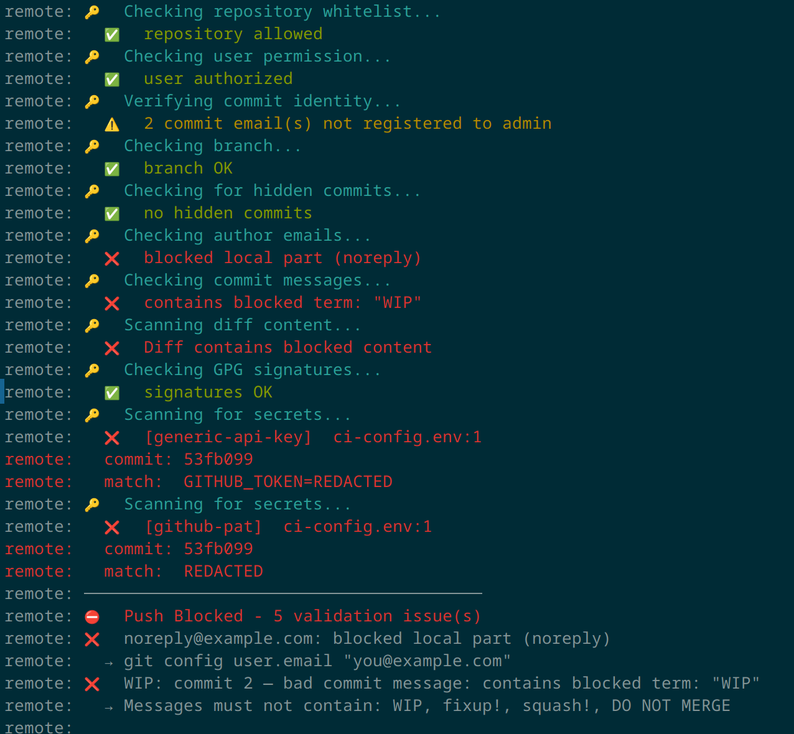

git-proxy-java — the experiment, running

<!--
Talking points (~60s):
This is an experiment. I'm using my own work context to prove, or disprove,
whether a green-field Java take is worth pursuing long-term. I'd love more
eyes on it, especially from FINOS members who operate GitProxy in anger. If
you try it and it doesn't fit, that's useful signal. If it fits, even better.
And whatever you conclude about the Java experiment, the Node project is still
where the users are today, and still where the philosophy lives. If you
haven't contributed to finos/git-proxy itself, please do that too. Thanks.
-->
